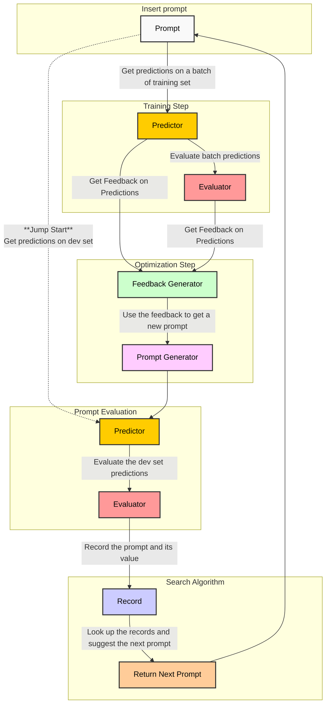

<!-- Color Palette:
- Prompt: #f9f9f9
- Predictor: #ffcc00
- Evaluator: #ff9999
- Feedback Generator: #ccffcc
- Prompt Generator: #ffccff
- Record: #ccccff
- Return Next Prompt: #ffcc99
- Insert prompt subgraph: #ffffff
- Prompt Evaluation subgraph: #e6f7ff
- Training Step subgraph: #e6ffe6
- Optimization Step subgraph: #fff0e6
- Search Algorithm subgraph: #f2e6ff
-->
